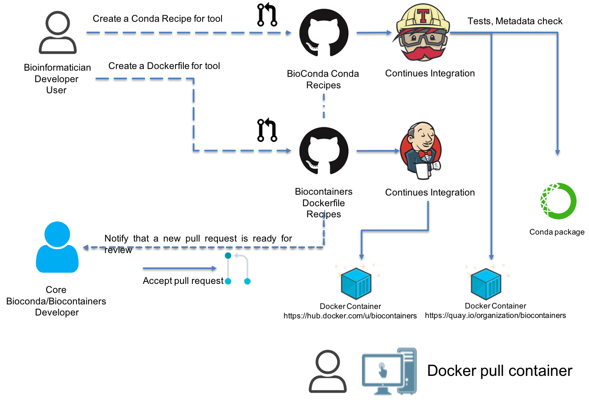

.. _biocontainers

BioContainers
===========================

BioContainers is a community-driven project that provides the infrastructure and basic guidelines to create, manage and distribute bioinformatics packages (e.g conda) and containers (e.g docker, singularity). BioContainers is based on the popular frameworks `Conda <https://conda.io/>`__, `Docker <https://www.docker.com/>`__ and `Singularity <https://www.sylabs.io/docs/>`__.

BioContainers Goals
-------------------

-  Provide a base specification and infrastructure to develop, build and deploy new bioinformatics software including the source and examples.

-  Provide a series of containers ready to be used by the bioinformatics community (https://biocontainers.pro/#/registry). 

-  Provide guidelines and help on how to create reproducible pipelines and workflows using bioinformatics containers.

-  Coordinate and integrate developers and bioinformaticians to produce best practices of documentation and software development.

Main components of BioContainers:
---------------------------------

-  `Docker Containers <https://github.com/BioContainers/containers>`__ provides a list of `Dockerfile recipes` to automatically build containers in BioContainers.

-  `Conda based Containers <https://github.com/bioconda/bioconda-recipes/>`__ provides a list of `Conda recipes` to automatically build **first a conda package** and then a docker container.

-  `Biocontainers Registry <https://biocontainers.pro/registry>`__ is a hosted registry of all BioContainers images that are ready to be used (read more here :doc:`biocontainersregistry`).

-  `Specifications <https://github.com/BioContainers/specs>`__ defines a set of guidelines and rules to contribute with BioContainers.

BioContainers Community Architecture
------------------------------------

BioContainers is a community-driven project that allows bioinformaticians/developers to request, build and deploy bioinformatics containers. The following figure present the general BioContainers Architecture:

.. image:: images/arch.png
   :alt: BioContainers Architecture.

How to Request a Container
~~~~~~~~~~~~~~~~~~~~~~~~~~~

Users can request a container by opening an issue in the `containers repository <http://github.com/BioContainers/containers/issues>`__ , In the previous workflow this is ``the first step`` performed by user ``henrik``. The issue should contains the name of the software, the url of the code or binary to be packaged and information about the software `see BioContainers specification <http://github.com/BioContainers/container-specs.md>`__. When the container is deployed and fully functional, the issue will be closed by the developer or the contributor to BioContainers.

.. note:: Before requesting a Container you should check the `BioContainers Registry <http://biocontainers.pro/registry>`__ to make sure your requested tool does not exist already (read more about the registry in: :doc:`biocontainersregistry`).

.. hint:: Importantly, the BioContainers community has implemented a "labeled legend" to tag each issue in the `containers repository <http://github.com/BioContainers/containers/issues>`__ that should be used properly for on each issue. For example, for new containers the label **Container Request** should be used.

Use a Docker BioContainer.
~~~~~~~~~~~~~~~~~~~~~~~~~~

When a container is deployed and the developer closes the issue in GitHub, the user ``henrik`` receives a notification that the container is ready. Then, the user can use ``docker`` command to pull or fetch the corresponding container.

.. code-block:: bash

   $ docker run biocontainers/blast:2.2.31

.. note:: You can read other sections about :doc:`conda_integration` and :doc:`singularitycontainers`

Reporting a problem with a container
~~~~~~~~~~~~~~~~~~~~~~~~~~~~~~~

If the user finds a problem with a container an issue should be opened in
the `container repository <https://github.com/BioContainers/containers/issues>`__, the user should use the **broken tag** (`see tags <https://github.com/BioContainers/containers/labels>`_). Developers of the project will pick-up the issue and deploy a new version of the container. A message will be delivered when the container has been fixed.

BioContainers build architecture
-------------------------------------------

BioContainers build the docker containers from two different sources the `Dockerfile <http://github.com/BioContainers/containers/>`__ or `Conda recipes <https://github.com/bioconda/bioconda-recipes/>`__ . The BioContainers team first try to create a Conda recipe (if it is possible). If not possible, then a Dockerfile is created. The system automatically builds the container after the ``pull request`` is merged into Conda github or BioContainer github repos.

In order to be able to contribute to BioContainers you should be able to create a BioConda recipe or a Dockerfile recipe.

Create a BioConda recipe
~~~~~~~~~~~~~~~~~~~~~~~

.. note:: Before you start please read the Conda documentation and `how to setup conda in your machine <https://conda.io/projects/conda-build/en/latest/source/user-guide/tutorials/index.html>`__

In summary should follow these steps:

- Fork the `BioConda recipes in GitHub <<https://github.com/bioconda/bioconda-recipes/>>`__
- Create your conda recipe (`following this tutorial <https://bioconda.github.io/contributor/index.html>`__)
- Create a Pull Request in BioConda

After the PR gets merged, a Conda package gets created and the corresponding docker container get pushed into `Quay.io Registry <https://quay.io/organization/biocontainers>`__  and the `BioContainers Registry <https://biocontainers.pro/#/registry>`__

Create a Dockerfile recipe
~~~~~~~~~~~~~~~~~~~~~~~

This is a standard template for creating a new Dockerfile for BioContainers:

.. note:: Please always follow the :doc:`best_practices` to create a Dockerfile.

Here, an example Dockerfile for a Biocontainer:

.. code-block:: bash

   ################## BASE IMAGE ######################
   FROM biocontainers/biocontainers:v1.0.0_cv4

   ################## METADATA ######################
   LABEL base_image="biocontainers:v1.0.0_cv4"
   LABEL version="3"
   LABEL software="crux"
   LABEL software.version="3.2"
   LABEL about.summary="a software toolkit for tandem mass spectrometry analysis"
   LABEL about.home="http://cruxtoolkit.sourceforge.net/"
   LABEL about.documentation="http://cruxtoolkit.sourceforge.net/"
   LABEL about.license_file="http://cruxtoolkit.sourceforge.net/"
   LABEL about.license="SPDX:Apache-2.0"
   LABEL extra.identifiers.biotools="crux"
   LABEL about.tags="Proteomics"

   ################## MAINTAINER ######################
   MAINTAINER Yasset Perez-Riverol <ypriverol@gmail.com>

   ################## INSTALLATION ######################

   USER biodocker

   RUN ZIP=crux-3.2.Linux.x86_64.zip && \
       wget https://github.com/BioContainers/containers/releases/download/Crux/$ZIP -O /tmp/$ZIP && \
       unzip /tmp/$ZIP -d /home/biodocker/bin/ && \
       rm /tmp/$ZIP && \
       ln -sv /home/biodocker/bin/*/bin/* /home/biodocker/bin/

   ENV PATH /home/biodocker/bin:$PATH

   WORKDIR /data/

Every Dockerfile must have a metadata header with the following items:

* **Base Image**\ : All containers are based on a specific GNU/Linux system. There is no preference for a specific OS flavor but, to reduce disk usage, we recommend to use our own biocontainers/biocontainers image.
* **Dockerfile Version**\ : This is a single-number version system (ex: v1, v2, v3 ...). Every change in the file must increase in 1.
* **Software**\ : The name of the software installed inside the container. This can be a little tricky because some software demands libraries or dependencies. In this case the idea is to describe the "principal" software of the container, or the reason for building it.
* **Software Version**\ : The version of the software installed.
* **Description**\ : Single line description of the tool.
* **Website**\ : URL(s) for the program developer.
* **Documentation**\ : URL(s) containing information about how to use the software.
* **License**\ : URL(s) containing Licensing information.
* **Tags**\ : Program tags: Genomics, Protemomics, Transcriptomics, Metabolomics, General.

**Image Setting**

The next element is the base image and any configuration to the system you are installing. In the example above the Base Image is defined as biocontainers/biocontainers which is based on ubuntu latest LTS (Long Term Support) release and kept up to date with updates.

**Signature**

The File Author/ Maintainer signature. By default the Dockerfile only accepts one MAINTAINER tag. This will be the place the original author name. After updates are added to the file, the contributors name should appear in commented lines.

.. code-block:: bash

   # Maintainer
   MAINTAINER Yasset Perez-Riverol <ypriverol@gmail.com>

**Installation**

The installation area is where the instructions to build the software will be defined. Here is the correct place to put Dockerfile syntax and system commands.

.. code-block:: bash

   USER biodocker

   RUN ZIP=comet_binaries_2016012.zip && \
     wget https://github.com/BioDocker/software-archive/releases/download/Comet/$ZIP -O /tmp/$ZIP && \
     unzip /tmp/$ZIP -d /home/biodocker/bin/Comet/ && \
     chmod -R 755 /home/biodocker/bin/Comet/* && \
     rm /tmp/$ZIP

   RUN mv /home/biodocker/bin/Comet/comet_binaries_2016012/comet.2016012.linux.exe /home/biodocker/bin/Comet/comet

   ENV PATH /home/biodocker/bin/Comet:$PATH

   WORKDIR /data/

   CMD ["comet"]

**Tips**

* Commands should be merged with '&& \' whenever possible in order to create fewer intermediate images.
* A biodocker user has been created (id 1001) so that applications are not run as root.
* If possible, add the program to /usr/bin, otherwise, add to /home/biodocker/bin
* return to the regular USER
* change the WORKDIR to the data folder
* set the VOLUME to be exported (/data and /config are exported by default by the base image)
* EXPOSE ports (if necessary)

Get involved
----------------------

|Slack|    |Gitter|      |IRC|

Whether you want to make your own software available to others as a container, to just use them on your pipelines and analysis or just give opinions, you are most welcome. This is a community-driven project, that
means everyone has a voice.

Here are some general ideas:

-  Browse our list of containers
-  Propose your own ideas or software
-  Interact with others if you think there is something missing.

.. |Slack| image:: https://img.shields.io/badge/slack-join%20chat-ff69b4.svg
   :target: https://biocontainers.slack.com
.. |Gitter| image:: https://badges.gitter.im/BioJS.png
   :target: https://gitter.im/biocontainers/Lobby
.. |IRC| image:: https://img.shields.io/badge/irc-%23BioContainers-yellow.svg
   :target: https://kiwiirc.com/client/irc.freenode.net/BioContainers

